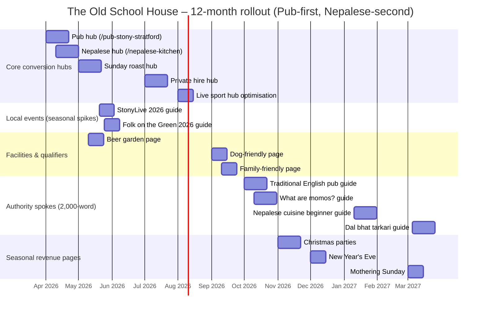

# Entity Map and Content Blueprint for The Old School House

## Executive summary

The fastest, most defensible route to consistent search-led bookings for The Old School House is to **acquire demand through the “Traditional English Pub in Stony Stratford” entity cluster** (high-intent local queries like “pub in Stony Stratford”, “Sunday roast”, “live sport”, “dog friendly pub”, “private hire”) and then **convert + differentiate** using the **Nepalese Kitchen** cluster (momo, dal-bhat-tarkari, spice levels, vegetarian options, “Himalayan”/Nepalese signatures). This mirrors how pubs are typically chosen in the real world—proximity, atmosphere, food/drink, social proof, sports/quiz nights—while allowing you to “surprise and delight” with Nepalese cuisine once a visitor is already on-site or on-page. citeturn13view1turn8view0turn22view0turn8view2

Current on-site signals already support the **pub-first acquisition** layer strongly: the site positions the venue as a “proper British pub,” highlights **live sport**, **pub deals**, **Sunday roasts**, and clear **dog-friendly**/**family-friendly** facilities, and contains booking guidance and contact details that can be promoted more aggressively across commercial pages. citeturn5search3turn8view2turn22view1turn8view0turn23view0

The local competitive set shows why you need a sharp differentiator: nearby pubs/hospitality venues lean on familiar propositions—**Sunday roast**, **cocktails/gins/whisky**, **function rooms**, **hotel rooms**, **live music/sport**—with few genuinely “ownable” food entities. citeturn9view0turn9view2turn27view1turn26view0  
Meanwhile, Nepalese demand in the wider Milton Keynes area is served by dedicated Nepalese/Indo-Nepalese operators (e.g., momo-led menus and Nepalese/Indian hybrids), meaning your Nepalese content must be **precise, credible, and structured** (menu entities, allergens, signature dishes) to compete beyond the pub category. citeturn18view0turn18view1turn15view0

Deliverables included below: a hierarchical entity map (hub/spoke/long-tail), a 12‑month plan with exact URLs and internal links, priority landing pages + conversion flows, schema recommendations, competitor “NL API style” entity/salience comparisons (top pages per target query), Wikipedia-derived attributes, local SEO signals + Google Business Profile optimisation, and content briefs for the top 10 pages.

## Evidence base and baseline entity signals

This report is grounded in: (a) the current public website pages for The Old School House (menus, offers, live sport, booking, contact/FAQ), (b) competitor pub and venue sites in/near Stony Stratford, (c) local area context for Stony Stratford (history, annual festivals), (d) Wikipedia entity scaffolding for pubs, Sunday roast, and Nepalese cuisine, and (e) Google’s official guidance on Business Profiles and structured data. citeturn8view0turn22view0turn8view2turn9view2turn9view0turn14view0turn13view1turn14view1turn15view0turn17view1turn16view0

### Current “pub-first” on-site positioning (what Google can already extract)

Key machine-readable entities and claims currently visible on the site include:

- **Location + NAP:** London Road, Stony Stratford, MK11 1JA; phone 01908 561936. citeturn8view0
- **Positioning:** “traditional English pub” serving “true British pub classics,” with local beer references (including entity["company","Brewpoint","brewery brand, Bedford, UK"]). citeturn8view0turn22view0
- **Facilities:** accessible, free Wi‑Fi, beer garden, private events, live sport, car parking, family-friendly, dog-friendly. citeturn8view1
- **Live sport proposition:** Sky Sports and TNT Sports, “matchday” framing, and a “Book for Sport” CTA. citeturn8view2
- **Commercial offers:** Sunday “starter and roast” offer (£17.99), weekday “2 pub classics,” lunch deal mechanics, and “Matchday Club” discount framing. citeturn22view1turn6search4
- **Booking flow copy:** guidance for special requests, “no availability” fallback to phone/email, and gift card upsell. citeturn23view0

It’s also worth noting that an official overview page from entity["company","Wells & Co","brewing company, UK"] describes the venue’s operational footprint (single bar layout, reported cover counts, external space, etc.). citeturn8view3

### Competitive reality in the immediate pub category

Competitors in the same local “pub choice set” commonly lead with:

- **Heritage + roast + broad drinks**: entity["restaurant","The Crown","Stony Stratford, Buckinghamshire, UK"] emphasises being a long-standing family pub and foregrounds Sunday roast, cocktails, and dietary options. citeturn9view0
- **Hotel + functions + facilities**: entity["hotel","The Cock Hotel","Stony Stratford, Buckinghamshire, UK"] (run by entity["company","Greene King","pub company, UK"]) combines pub food with hotel rooms, functions, extensive facilities, and strong seasonal campaign pages (Easter/Christmas). citeturn9view2turn26view0
- **Live sport + entertainment calendar**: entity["restaurant","Fox & Hounds","Stony Stratford, Buckinghamshire, UK"] positions around sport, music, quizzes, karaoke, and weekly events. citeturn27view1turn27view0

This means “Traditional English Pub” is necessary for acquisition—but **not sufficient for differentiation**. The Nepalese Kitchen must be engineered as a **secondary entity cluster** that appears consistently in: (1) your menu architecture, (2) your page taxonomy, (3) structured data, (4) internal linking, and (5) Google Business Profile attributes/services.

## Dual-entity strategy for acquisition and differentiation

A “pub-first, Nepalese-second” strategy works best when you treat entities the way Google’s knowledge systems do:

- A **pub** is not simply “a restaurant”; it’s an establishment with cultural expectations: draught beer/cider, bar service, areas not solely for meals, a social/community function, and common pub behaviours like screening sport and hosting quizzes. citeturn13view1
- A **Sunday roast** is a highly-defined British food entity with expected components (roast meat, roast/mashed potatoes, Yorkshire pudding, gravy, stuffing, vegetables, condiments). The more your Sunday roast pages align to these expectations (text + images + menu entities), the more confidently Google can match you to roast-intent searches. citeturn14view1
- **Nepalese cuisine** is not interchangeable with generic “curry.” Wikipedia’s entity framing highlights dal-bhat-tarkari and momo as recognisable anchors, plus condiments like achaar. If you want to own Nepalese as a differentiator, you should explicitly name and explain these anchors, rather than hiding them under “specials.” citeturn15view0

The practical implication for your website system:

- **Acquisition hubs** should rank for: “pub in Stony Stratford”, “Sunday roast”, “live sport”, “private hire”, “dog friendly pub”, “family friendly pub”.
- Those hubs should contain **structured discovery modules** for Nepalese (e.g., “Try our Nepalese Kitchen: momo + dal bhat + chef’s curries”), funnelling curiosity into your Nepalese hub and ultimately into booking.
- **Nepalese spokes** (2,000-word guides) should be written to satisfy “What is [X]?” intent and feed authority back into the **Nepalese Kitchen** hub (and indirectly into the pub hubs through cross-linking).

image_group{"layout":"carousel","aspect_ratio":"16:9","query":["Stony Stratford High Street London Road","Horsefair Green Stony Stratford","traditional British pub interior England","Nepalese momo dumplings plate"],"num_per_query":1}

## Hierarchical entity map with hubs, spokes, and long-tail questions

### Visual entity map

**PNG:** [Download](sandbox:/mnt/data/osh_entity_map_pub_primary.png)  
**SVG:** [Download](sandbox:/mnt/data/osh_entity_map_pub_primary.svg)

### Wikipedia-derived first-level attributes to use as “non-negotiable hubs”

| Core entity      | Wikipedia-derived attributes you should explicitly cover                                                                                                                 | How it becomes a hub on your site                                                    |
| ---------------- | ------------------------------------------------------------------------------------------------------------------------------------------------------------------------ | ------------------------------------------------------------------------------------ |
| Pub              | Licensed drinking establishment; draught beer/cider; bar service; social/community role; meals/snacks; sport screening; pub quiz; games (darts/pool). citeturn13view1 | “Pub in Stony Stratford” hub + supporting pages (sport, quiz, drinks, atmosphere).   |
| Sunday roast     | Roast meat + potatoes + Yorkshire pudding + gravy + stuffing; veg + condiments; “Sunday lunch/dinner” synonyms. citeturn14view1                                       | “Sunday roast” commercial hub + explainer spokes (what’s included, booking, timing). |
| Nepalese cuisine | Dal-bhat-tarkari; momo; achaar; regional diversity; staple framing. citeturn15view0                                                                                   | “Nepalese Kitchen” hub + spokes on momo, dal-bhat, spice levels, vegetarian.         |
| Stony Stratford  | Market town on Watling Street (London Road/High Street naming); early June StonyLive culminating in Folk on the Green on Horsefair Green. citeturn14view0             | “Find us / local area” hub + seasonal event guides (StonyLive/Folk on the Green).    |

### Hierarchical entity map (centre → branches → sub-branches → long-tail)

**Centre (Primary acquisition entity): Traditional English Pub in Stony Stratford (The Old School House)**  
Your “pub” identity is the central hub because it aligns to the highest-volume, highest-intent local discovery queries and matches how competing venues are positioned. citeturn5search3turn8view0turn9view2turn9view0

Below is the complete hierarchy. Labels: **[Hub]** pillar page, **[Spoke]** 2,000-word guide, **[Long-tail]** short-form Q/A or blog post (often mirrors PAA-style questions). Where long-tail questions already exist in your FAQ copy, that is noted. citeturn8view0

- **Traditional English Pub in Stony Stratford (Centre) [Hub]**
  - **Pub identity & atmosphere [Hub]**
    - What makes it a “traditional pub” [Spoke]
      - What is a “local” pub? [Long-tail]
      - Do pubs serve food? [Long-tail]
    - Community pub positioning [Spoke]
      - What makes a pub “at the heart of the community”? [Long-tail]
    - History snapshot: building identity and “Old School House” naming [Long-tail] (tie to local town history and travel route heritage) citeturn14view0turn8view3
  - **Food & drink (pub-led) [Hub]**
    - Pub classics [Spoke]
      - What are “pub classics”? [Long-tail]
      - Do you have vegetarian pub food? [Long-tail]
    - Sunday roast [Hub]
      - What comes with a Sunday roast? [Long-tail] citeturn14view1
      - Do I need to book for Sunday lunch? [Long-tail]
    - Drinks: ales/beer, wine, spirits, softs, coffee [Spoke]
      - Do you have cask ale? [Long-tail] (validate with bar range / local listings where applicable) citeturn0search20
      - Do you serve local beer? [Long-tail] citeturn8view0turn22view0
  - **Live sport & matchdays [Hub]**
    - Sky Sports + TNT Sports [Spoke] citeturn8view2
      - Do you show football? [Long-tail]
      - Can I book a table for sport? [Long-tail] citeturn8view2
    - What you show (football/rugby/F1/boxing etc.) [Long-tail] citeturn8view2
    - Matchday Club / sport offers [Long-tail] citeturn8view2turn22view1
  - **Events & private hire [Hub]**
    - Private hire & functions [Hub]
      - Can I hire an area for a private event? [Long-tail] (already answered in FAQ) citeturn8view0
      - What’s your capacity / group size guidance? [Long-tail] (capacity specifics should be confirmed; seat-cover indicators exist from the owner listing) citeturn8view3turn23view0
    - Quiz night / community events [Spoke] (build your own event calendar to compete with entertainment-heavy pubs) citeturn13view1turn27view1
      - What night is quiz night? [Long-tail]
    - Seasonal events (Easter/Christmas/World Cup etc.) [Spoke] citeturn9view2turn22view1
      - Are you open on Bank Holidays / festive dates? [Long-tail]
  - **Facilities & accessibility [Hub]**
    - Dog-friendly [Spoke]
      - Are you dog friendly? [Long-tail] (already answered in FAQ) citeturn8view0
      - Where can dogs sit? [Long-tail] (already partially implied: “certain areas for dining”) citeturn8view0
    - Family-friendly [Spoke]
      - Are you family friendly? [Long-tail] (already answered in FAQ) citeturn8view0
      - Is it still calm for families during sport? [Long-tail] (already addressed via “calmer areas”) citeturn8view0
    - Accessible / Wi‑Fi / parking / beer garden [Spoke] citeturn8view1
      - Is there parking nearby? [Long-tail]
  - **Location & local discovery [Hub]**
    - London Road / Watling Street positioning [Spoke] (help “near me” and “how to find” intent) citeturn14view0turn8view0
      - Where are you located in Stony Stratford? [Long-tail] (already answered in FAQ) citeturn8view0
    - Horsefair Green & festival footfall [Spoke] citeturn11view3turn12view2turn12view0
      - What is StonyLive? [Long-tail]
      - When is Folk on the Green? [Long-tail]
    - Nearby attractions & walks [Long-tail] (Nature Reserve, Museum, Centre MK, Willen Park are already listed) citeturn8view0
  - **Nepalese Kitchen (Secondary differentiator) [Hub]**
    - What is Nepalese cuisine? [Spoke] citeturn15view0
      - What is dal-bhat-tarkari? [Long-tail] citeturn15view0
    - Signature dishes: momo + curries [Spoke] citeturn15view0turn15view1
      - What are momos? [Long-tail] citeturn15view1
    - Spice levels, veg, allergens [Spoke]
      - Can you make dishes mild? [Long-tail]
      - How do you handle allergens? [Long-tail] (you already have allergen handling copy, but it’s framed for pub menus; replicate for Nepalese menus) citeturn22view0

## Twelve-month content plan with URLs, metadata, intent stages, and internal linking

### Internal linking rules (non-negotiable)

1. Every **commercial hub** must link (above the fold) to **/book-a-table/** and **/our-menus/**, because these are your highest-intent conversion actions. citeturn23view0turn22view0
2. Every **spoke guide** links back to its **hub** in the first 200 words (“Read next” module) and again at the end (“Ready to visit?” CTA).
3. Every **pub-first hub** includes a “Nepalese Kitchen” module (3–5 lines + 3 signature dish entities + CTA), linking into the Nepalese hub.
4. Every **Nepalese spoke** includes a “Also a proper pub” module linking back to the pub hub and live-sport/sunday-roast hubs (cross-sell).
5. Event pages must link to: **Find us** (or Contact), **Book**, and the most relevant food hub for pre/post event dining. citeturn8view0turn23view0turn22view0

### 12‑month publishing and optimisation schedule (Apr 2026 → Mar 2027)

Assumptions: your site can publish new indexable pages and update existing ones; the exact booking widget provider is not visible in the HTML output (embedded “Book a Table” component), so it is treated as **unspecified**. citeturn23view0

| Month    | URL (exact)                                 | Page type               | SEO title (en‑GB)                            | Meta description (≤155 chars)                                                                                       | Target intent stage      | Word count target | Internal linking (minimum set)                                                             |
| -------- | ------------------------------------------- | ----------------------- | -------------------------------------------- | ------------------------------------------------------------------------------------------------------------------- | ------------------------ | ----------------: | ------------------------------------------------------------------------------------------ |
| Apr 2026 | /pub-stony-stratford/                       | Hub (pillar)            | Pub in Stony Stratford                       | A traditional English pub on London Road. Food, Sunday roasts, live sport, beer garden. Book a table today.         | Solution‑ready           |             1,400 | → /book-a-table/, /our-menus/, /live-sports/, /nepalese-kitchen-stony-stratford/           |
| Apr 2026 | /nepalese-kitchen-stony-stratford/          | Hub (pillar)            | Nepalese Kitchen in Stony Stratford          | Discover Nepalese flavours at your local pub: momo, dal bhat, curries, and pub classics. View menus & book.         | Solution‑aware           |             1,600 | → /our-menus/, /book-a-table/, /pub-stony-stratford/                                       |
| May 2026 | /sunday-roast-stony-stratford/              | Commercial hub          | Sunday Roast in Stony Stratford              | Proper Sunday roasts with all the trimmings. See times, what’s included, and how to book Sunday lunch.              | Solution‑ready           |             1,200 | → /book-a-table/, /our-menus/, /pub-deals/                                                 |
| May 2026 | /beer-garden-stony-stratford/               | Commercial spoke        | Beer Garden Pub in Stony Stratford           | Enjoy drinks and pub food outdoors. Dog‑friendly seating, summer pints, and Sunday roasts—minutes from High Street. | Solution‑ready           |             1,000 | → /book-a-table/, /pub-stony-stratford/, /contact-us/                                      |
| Jun 2026 | /stonylive-2026-pub-guide/                  | Seasonal spoke          | StonyLive 2026: Where to Eat & Drink         | Visiting StonyLive (6–14 June 2026)? Food, pints, pre‑event dinners and how to book in Stony Stratford.             | Problem‑aware → solution |             1,300 | → /book-a-table/, /find-us/, /pub-stony-stratford/ citeturn12view2                      |
| Jun 2026 | /folk-on-the-green-2026-pub-guide/          | Seasonal spoke          | Folk on the Green 2026: Pub Plan             | Folk on the Green is 14 June 2026 (12–7pm). Plan your pub visit: lunch, drinks, and bookings near Horsefair Green.  | Problem‑aware → solution |             1,300 | → /book-a-table/, /find-us/, /sunday-roast-stony-stratford/ citeturn12view0             |
| Jul 2026 | /private-hire-stony-stratford/              | Commercial hub          | Private Hire in Stony Stratford              | Birthdays, wakes, clubs and group meals. Enquire about private hire and group bookings at The Old School House.     | Solution‑ready           |             1,200 | → /contact-us/, /book-a-table/, /our-menus/ citeturn8view0turn23view0                  |
| Jul 2026 | /birthday-party-venue-stony-stratford/      | Spoke                   | Birthday Party Venue Stony Stratford         | Planning a birthday in Stony Stratford? Food, drinks, spaces and booking tips for groups at a proper local pub.     | Solution‑ready           |             1,500 | → /private-hire-stony-stratford/, /book-a-table/                                           |
| Aug 2026 | /live-sport-stony-stratford/ (optimise)     | Commercial hub          | Live Sport Pub in Stony Stratford            | Sky Sports & TNT Sports in Stony Stratford. Book for matchday, grab pub food, and enjoy the atmosphere.             | Solution‑ready           |             1,100 | → /book-a-table/, /our-menus/, /pub-deals/ citeturn8view2turn22view1                   |
| Aug 2026 | /watch-football-stony-stratford/            | Spoke                   | Where to Watch Football in Stony Stratford   | Big screens, match‑day pints and pub food. Book ahead for key fixtures at The Old School House.                     | Solution‑ready           |             1,400 | → /live-sport-stony-stratford/, /book-a-table/                                             |
| Sep 2026 | /dog-friendly-pub-stony-stratford/          | Commercial spoke        | Dog Friendly Pub in Stony Stratford          | A dog‑friendly pub with designated dining areas. Bring your dog—tell us in advance when booking.                    | Solution‑ready           |               900 | → /book-a-table/, /contact-us/, /beer-garden-stony-stratford/ citeturn8view0turn8view1 |
| Sep 2026 | /family-friendly-pub-stony-stratford/       | Commercial spoke        | Family Friendly Pub in Stony Stratford       | Family‑friendly pub dining with calmer areas away from TVs. Kids menus, roasts, and easy bookings in MK11.          | Solution‑ready           |             1,000 | → /our-menus/, /book-a-table/, /contact-us/ citeturn8view0turn22view0                  |
| Oct 2026 | /guides/traditional-english-pub/            | Spoke (2,000w)          | What Is a Traditional English Pub?           | A practical guide to what makes a pub a pub—plus how to choose the right one in Stony Stratford.                    | Problem‑aware            |             2,000 | → /pub-stony-stratford/, /book-a-table/ citeturn13view1                                 |
| Oct 2026 | /guides/what-are-momos/                     | Spoke (2,000w)          | What Are Momos? Nepalese Dumplings Explained | What momo are, how they’re served, and why they’re a Nepalese favourite—plus where to try them locally.             | Problem‑aware            |             2,000 | → /nepalese-kitchen-stony-stratford/, /book-a-table/ citeturn15view1turn15view0        |
| Nov 2026 | /christmas-parties-stony-stratford/         | Seasonal commercial hub | Christmas Parties in Stony Stratford         | Planning Christmas drinks or a festive meal? Book ahead for groups, food packages and easy pub celebrations.        | Solution‑ready           |             1,300 | → /private-hire-stony-stratford/, /book-a-table/                                           |
| Nov 2026 | /gift-cards/ (or existing link destination) | Commercial support      | Pub Gift Cards                               | Treat someone to a pub meal, Sunday lunch, or drinks. Gift cards available for The Old School House.                | Solution‑ready           |               700 | → /book-a-table/, /our-menus/ citeturn23view0                                           |
| Dec 2026 | /new-years-eve-stony-stratford/             | Seasonal spoke          | New Year’s Eve in Stony Stratford            | Celebrate New Year’s Eve at your local pub: drinks, atmosphere, and booking info.                                   | Solution‑ready           |             1,000 | → /book-a-table/, /live-sport-stony-stratford/                                             |
| Dec 2026 | /opening-times/                             | Utility page            | Opening Times                                | Opening times, food times, and seasonal updates. Call us if you need a last‑minute booking.                         | Solution‑ready           |               600 | → /contact-us/, /book-a-table/ citeturn8view0turn8view1                                |
| Jan 2027 | /quiz-night-stony-stratford/                | Event spoke             | Quiz Night in Stony Stratford                | Quiz night details, start time, team sizes and how to book a table.                                                 | Problem‑aware → solution |               900 | → /book-a-table/, /pub-stony-stratford/ citeturn13view1                                 |
| Jan 2027 | /guides/nepalese-cuisine-introduction/      | Spoke (2,000w)          | Nepalese Cuisine: A Beginner’s Guide         | Dal bhat, momo, achar and classic flavours—what to order and how to choose spice levels.                            | Problem‑aware            |             2,000 | → /nepalese-kitchen-stony-stratford/, /our-menus/ citeturn15view0                       |
| Feb 2027 | /valentines-day-stony-stratford/            | Seasonal spoke          | Valentine’s Day in Stony Stratford           | A relaxed pub date night: food, drinks, and how to book a table for Valentine’s Day.                                | Solution‑ready           |               900 | → /book-a-table/, /our-menus/                                                              |
| Feb 2027 | /half-term-family-dining/                   | Seasonal spoke          | Half‑Term Family Pub Dining                  | Family-friendly dining during half term: kids menus, calmer areas, and booking tips.                                | Solution‑ready           |               900 | → /family-friendly-pub-stony-stratford/, /book-a-table/ citeturn22view0turn8view0      |
| Mar 2027 | /mothering-sunday-stony-stratford/          | Seasonal commercial     | Mothering Sunday in Stony Stratford          | Mothering Sunday bookings, roasts, drinks and family-friendly dining. Book early for the best times.                | Solution‑ready           |             1,000 | → /sunday-roast-stony-stratford/, /book-a-table/                                           |
| Mar 2027 | /guides/dal-bhat-tarkari/                   | Spoke (2,000w)          | Dal Bhat Tarkari Explained                   | What it is, how it’s eaten, and how it fits into Nepalese cuisine—plus what to try at a Nepalese kitchen.           | Problem‑aware            |             2,000 | → /nepalese-kitchen-stony-stratford/ citeturn15view0                                    |

### Mermaid rollout timeline (12 months)

Seasonal timing is informed by the publicly stated StonyLive 2026 dates (6–14 June 2026) and the Folk on the Green date (14 June 2026, 12–7pm). citeturn12view2turn12view0

## Priority commercial landing pages and conversion flows

### Priority landing pages (commercial intent)

These are the pages most likely to drive direct conversions and should be treated as “Tier 1” for design, CTA placement, and structured data.

| Priority | URL                                | Primary conversion   | Why it matters                                                                                                                                                   |
| -------- | ---------------------------------- | -------------------- | ---------------------------------------------------------------------------------------------------------------------------------------------------------------- |
| Highest  | /book-a-table/                     | Booking              | Contains booking guidance + phone/email fallback; should be linked from every page, above the fold. citeturn23view0                                           |
| Highest  | /our-menus/                        | Menu views → booking | Menu pages are primary “proof” pages in hospitality; your current page explicitly frames British pub food and links to menus hosted off-site. citeturn22view0 |
| High     | /pub-stony-stratford/              | Booking              | Acquisition hub for local “pub” search intent; needs a Nepalese teaser module for differentiation.                                                               |
| High     | /sunday-roast-stony-stratford/     | Booking              | “Sunday roast” is a strong UK intent pattern with clear expectations; you already promote Sunday roast offers. citeturn22view1turn14view1                    |
| High     | /live-sport-stony-stratford/       | “Book for sport”     | Live sport is explicitly promoted and tied to Sky Sports/TNT Sports and booking. citeturn8view2                                                               |
| High     | /private-hire-stony-stratford/     | Enquiry              | Your FAQ already claims you regularly host christenings, birthday parties and wakes; formalise this into a conversion page. citeturn8view0                    |
| Medium   | /nepalese-kitchen-stony-stratford/ | Menu views → booking | Differentiator hub to “upgrade” visitors who arrived for pub basics into high-intent Nepalese diners.                                                            |

### Conversion flow design

**Bookings flow (table booking):**

1. Entry pages (pub hub / roast / sport / menus) →
2. “View menu” (proof) or “Check times” (friction removal) →
3. “Book a table” CTA to /book-a-table/ with clear reassurance copy + fallback phone/email →
4. Confirmation and “what to expect” module (parking, dog areas, sport screens). citeturn23view0turn8view1turn8view0

**Private hire flow (functions):**

1. Entry via “private hire” query → /private-hire-stony-stratford/ →
2. Above-the-fold enquiry form + capacity cues + sample buffet/menu options (even if “from £X” is TBD) →
3. Confirmation page + calendar prompt →
4. Sales follow-up + upsell packages (welcome drinks, buffet tiers, reserved screens for sport).  
   Competitors in the area explicitly lean on “function room” language and buffet-download mechanics, so your private hire page needs comparable clarity and speed. citeturn9view1turn26view0

**Nepalese “discovery → conversion” flow (secondary differentiator):**

1. Visitor arrives on pub acquisition page (pub hub, roast, sport) →
2. “Unexpected highlight” module: “Try our Nepalese Kitchen” with 3 named anchors (momo, dal bhat, achaar/curry special) that match how Nepalese cuisine is commonly defined and searched →
3. Deep click to Nepalese hub →
4. Menu entities (sections + 6–10 signature dish cards) + spice-level chooser →
5. Book. citeturn15view0turn15view1

## Schema recommendations and key fields

Google’s guidance is explicit: structured data must be a **true representation of the page content**, and missing required properties can make pages ineligible for rich results. citeturn17view3turn16view0  
This matters especially for hospitality websites where menu items, events, and opening hours frequently drift out of date.

### Suggested schema types by page class

| Page class                                                  | Recommended schema types                     | Key fields to include (minimum viable)                                                                      | Notes                                                                                                             |
| ----------------------------------------------------------- | -------------------------------------------- | ----------------------------------------------------------------------------------------------------------- | ----------------------------------------------------------------------------------------------------------------- |
| Site-wide (header/footer)                                   | LocalBusiness / Restaurant                   | name, address, telephone, url, openingHoursSpecification, geo, sameAs (social profiles), servesCuisine      | Google explicitly recommends using the most specific LocalBusiness subtype (e.g., Restaurant). citeturn16view0 |
| Menu hub                                                    | Menu + MenuSection + MenuItem + Offer        | hasMenuSection, hasMenuItem, name, description, price + priceCurrency in Offer, suitableForDiet where valid | MenuItem is the schema.org type for items on a menu. citeturn4search3                                          |
| Booking page                                                | LocalBusiness/Restaurant + potentialAction   | potentialAction (ReserveAction) where supported; url to booking                                             | If you later integrate via Google booking partners/APIs, align markup accordingly. citeturn16view0             |
| Events pages (quiz night, StonyLive guide, seasonal events) | Event                                        | name, startDate, endDate, location (Place), offers (Offer), description, image                              | Event schema has its own Google documentation and eligibility rules. citeturn17view2turn17view3               |
| Offers pages (deals)                                        | Offer (nested within relevant page entities) | price, priceCurrency, validFrom, validThrough, availability, eligibleRegion                                 | Keep offers consistent with the visible offer terms and dates. citeturn22view1turn17view3                     |

### Fields you should treat as “data governance” (keep consistent everywhere)

- **Name, address, phone** (“NAP”) must match the real-world presence and should be consistently represented across your website and your Google presence. citeturn17view1turn8view0
- **Opening hours**: your site currently advises checking Google for latest hours; align GBP and website hours, and add a dedicated “Opening times” utility page to reduce confusion. citeturn8view1turn22view0
- **Cuisine signals**: keep “Traditional English Pub” as the primary framing, but consistently attach Nepalese as a secondary qualifier via servesCuisine and visible on-page copy (only if true and delivered). citeturn17view3turn15view0

## Competitor SERP entity analysis with NL API-style entity lists and salience

Method note: Google’s Natural Language API outputs entity salience scores; the tables below emulate that format using on-page headings, repeated terms, and structural prominence (above-fold sections, nav labels, and repeated entities). This is directional but still highly actionable for identifying entity gaps and over/under-emphasis relative to SERP winners.

### Target query cluster: “pub in Stony Stratford” (acquisition)

Top pages observed for this query cluster include The Crown, The Cock Hotel, and The Old School House itself. citeturn5search0turn5search1turn5search3

| Page (top result set)         | Google‑NL‑style top entities (salience 0–1)                                                                                                                                                                                                                                             | Entity gaps/opportunities for The Old School House                                                                                                                                                 |
| ----------------------------- | --------------------------------------------------------------------------------------------------------------------------------------------------------------------------------------------------------------------------------------------------------------------------------------- | -------------------------------------------------------------------------------------------------------------------------------------------------------------------------------------------------- |
| The Old School House homepage | Stony Stratford (0.18), British pub food (0.16), live sport (0.12), Sunday roasts (0.10), pub deals (0.08), family-friendly (0.07), dog-friendly (0.06), booking (0.06), offers/value (0.05), Wells & Co (0.04) citeturn5search3                                                     | Add explicit Nepalese entities (momo, dal bhat, achaar) as a differentiator module on pub pages; ensure they are not hidden only in PDFs. citeturn15view0turn4search3                          |
| The Crown                     | Sunday roast (0.16), brunch/afternoon tea (0.12), cocktails/gins/whisky (0.12), breakfast/lunch/dinner (0.10), vegan/gluten‑free (0.08), function/events (0.08), Stony Stratford (0.12), booking (0.07), “family pub” (0.07), heritage date (0.06) citeturn9view0                    | Your advantage: sport + value offers + Nepalese. Their advantage: brunch/afternoon tea as distinct food entities. Counter by building your own “occasions” pages (date night, celebrations, etc.). |
| The Cock Hotel                | hotel/bedrooms (0.14), facilities list (0.12), pub food/menu (0.12), dog friendly (0.08), functions/venue hire (0.10), Stony Stratford (0.10), seasonal events (0.08), beers/ales (0.08), booking (0.10), entity["company","Greene King","pub company, UK"] (0.08) citeturn9view2 | They “own” hotel + functions entities; you can win groups by being more transparent (capacity, enquiry form, packages) and by pairing function dining with Nepalese options. citeturn26view0    |

### Target query cluster: “Sunday roast Stony Stratford” (high-intent food)

| Page (top result set)                    | Google‑NL‑style top entities                                                                                                                                                                                                      | Entity gaps/opportunities                                                                                                                                                  |
| ---------------------------------------- | --------------------------------------------------------------------------------------------------------------------------------------------------------------------------------------------------------------------------------- | -------------------------------------------------------------------------------------------------------------------------------------------------------------------------- |
| The Old School House offers (roast deal) | Sunday roast (0.18), starter+roast offer (0.14), “traditional trimmings” (0.10), booking (0.10), Sunday lunch timing (0.08), pub (0.08), value (0.08), terms (0.06), Stony Stratford (0.08), Wells & Co (0.05) citeturn22view1 | Create a dedicated roast hub page that names expected roast entities (Yorkshire pudding, gravy, stuffing, meats) to align with how the dish is defined. citeturn14view1 |
| The Crown                                | Sunday roast (0.16), “all the trimmings” (0.10), breakfast/lunch/dinner (0.10), cocktails (0.10), vegan/GF options (0.08), booking (0.08), Stony Stratford (0.10) citeturn9view0                                               | Compete with clarity: roast components, cut-off times, booking advice, and photos—plus cross-sell Nepalese “Sunday alternatives” for mixed groups.                         |
| The Cock Hotel                           | roast imagery/seasonal menus (0.12), pub food (0.12), booking (0.12), hotel (0.10), beers (0.08), dog-friendly (0.06), Stony Stratford (0.08) citeturn9view2                                                                   | Your roast pages should be put on a faster conversion path (roast → menu → book) and include FAQs on group bookings, dogs, and kids roasts. citeturn22view0turn8view0  |

### Target query cluster: “live sport Stony Stratford pub” (matchday intent)

| Page (top result set)                     | Google‑NL‑style top entities                                                                                                                                                                                     | Notes for your positioning                                                                                                                        |
| ----------------------------------------- | ---------------------------------------------------------------------------------------------------------------------------------------------------------------------------------------------------------------- | ------------------------------------------------------------------------------------------------------------------------------------------------- |
| The Old School House live sport page      | live sport (0.18), Sky Sports (0.12), TNT Sports (0.10), football/rugby/F1/boxing (0.10), booking (“Book for Sport”) (0.10), matchday atmosphere (0.09), pub food (0.08), matchday club (0.07) citeturn8view2 | Strong base. Add fixture-led landing pages only if you can keep them current; otherwise focus on intent pages (watch football, book for sport).   |
| Fox & Hounds “Live Sport Stony Stratford” | live sport (0.16), venue identity (0.10), Stony Stratford (0.10), entertainment (0.10), opening hours (0.08), contact info (0.08) citeturn27view0                                                             | They compete by volume of events and entertainment. Counter with clarity + booking UX + food offers for matchdays. citeturn22view1turn23view0 |
| Fox & Hounds homepage                     | live sports + music (0.16), weekly schedule (0.14), quiz/karaoke (0.10), Sky Sports football (0.08), darts/pool (0.06), “cultural hub” (0.06) citeturn27view1                                                 | Consider adding a lightweight weekly “What’s on” calendar page (your site already has offers; extend to events). citeturn22view1turn13view1   |

### Target query cluster: “private hire Stony Stratford” (group conversion)

| Page (top result set)                     | Google‑NL‑style top entities                                                                                                                                          | Notes for your positioning                                                                                                                |
| ----------------------------------------- | --------------------------------------------------------------------------------------------------------------------------------------------------------------------- | ----------------------------------------------------------------------------------------------------------------------------------------- |
| The Crown private hire page               | function room (0.18), occasions list (0.16), buffet options (0.10), “warm and welcoming space” (0.10), download menu (0.10), contact/enquiry (0.10) citeturn9view1 | Build equivalent transparency: capacities, sample packages, enquiry form, response time.                                                  |
| The Cock Hotel venue hire                 | venue hire (0.16), functions/occasions (0.14), tailored menus (0.10), dietary needs (0.08), book online (0.08), location (0.08) citeturn26view0                    | Copy pattern to match: “How to book” section + reassurance + menu flexibility—then add Nepalese menu as a unique “function buffet” angle. |
| The Old School House FAQ (private events) | private events (0.12), christenings/birthdays/wakes (0.12), “larger groups” (0.10), booking (0.10), contact info (0.10) citeturn8view0                             | Your claim exists but is buried in FAQs—promote it to a dedicated landing page and structured enquiry flow.                               |

### Target query cluster: “Nepalese restaurant Milton Keynes / momo” (differentiator demand)

| Page (top result set)                  | Google‑NL‑style top entities                                                                                                                                                                                 | What you should copy vs avoid                                                                                                                 |
| -------------------------------------- | ------------------------------------------------------------------------------------------------------------------------------------------------------------------------------------------------------------ | --------------------------------------------------------------------------------------------------------------------------------------------- |
| Himalaya Tandoori                      | Nepalese cuisine (0.14), Indian cuisine (0.12), Indo‑Chinese (0.10), momo (0.08), Bletchley/Milton Keynes (0.10), tandoor (0.08), biryani/naan (0.08), lunch menu (0.06), catering (0.06) citeturn18view0 | Copy: explicit dish naming + pricing + menu structure + reservation cues. Avoid: over-broad taxonomy that turns “Nepalese” into “everything.” |
| Himalayan Gurkha Food                  | momo (0.16), Open Market (0.12), Milton Keynes (0.12), “Nepalese foods” (0.10), steam/fry/chilli momo variants (0.10) citeturn18view1turn20search13                                                      | Copy: tight signature focus (momo variants) + clear location. Use on your Nepalese hub as “signature dish” cards.                             |
| Nepalese cuisine (definition baseline) | dal-bhat-tarkari (0.18), momo (0.16), achaar (0.10), Nepal geography/diversity (0.10) citeturn15view0                                                                                                     | Use these as your “canonical Nepalese anchors” so your Nepalese hub reads as authoritative, not decorative.                                   |

## Local SEO signals and Google Business Profile optimisation

### Local entity signals to build into content and citations

Stony Stratford’s most consistent “local spike” is early June: StonyLive (6–14 June 2026) culminating in Folk on the Green on Horsefair Green. citeturn12view2turn12view0turn14view0  
Horsefair Green itself has a distinct local-history narrative, including its historic use as a horse-trading site and its role as a main open space; this is useful for “things to do” style content and for building genuine local relevance on your location pages. citeturn11view3  
Stony Stratford’s identity as a market town on Watling Street (with London Road/High Street naming) is a strong “local context” entity cluster for your Find Us page and hub pages. citeturn14view0turn8view0

### Recommended Google Business Profile (GBP) optimisation

Key actions below are grounded in Google’s own documentation:

- **Category discipline:** choose the fewest categories needed to describe the core business; categories affect local ranking. For pub-first acquisition, prioritise a pub-appropriate primary category and add restaurant/cuisine categories only as needed (as available in GBP’s category list). citeturn15view3turn17view1
- **Attribute completion:** attributes can surface on Search/Maps and may help you appear for attribute-led searches (e.g., “beer garden”, “Wi‑Fi”, accessibility). Complete and routinely check them, because some may be user-suggested or change over time. citeturn17view0
- **Real-world consistency:** ensure your name/address/phone and brand representation match how you are recognised in the real world; keep address precise; maintain one profile per business. citeturn17view1turn8view0
- **Local links:** ensure GBP links point to the most relevant URLs: /book-a-table/, /our-menus/, /pub-stony-stratford/, /nepalese-kitchen-stony-stratford/, /private-hire-stony-stratford/. Google documentation explicitly frames structured data and business details as supporting clearer display in Search/Maps contexts. citeturn16view0

### Local citations and map ecosystem (what to standardise)

Because Google emphasises that a Business Profile should reflect how you’re consistently represented across the real world, your priority is ensuring **NAP consistency** across the web (major directories, hospitality listings, review platforms, Apple/Bing maps). Keep the same format for address, phone, and opening hours, and ensure the website’s “Find us” block matches the GBP exactly. citeturn17view1turn8view0  
Your own site already references local attraction distances; formalising these on a “Find Us”/local page helps anyone searching in-map for “near X” journeys. citeturn8view0

## Content briefs for the top 10 pages (headlines, outlines, key entities, CTAs, internal links)

Each brief below is written to support the dual strategy: **Pub acquisition** first, **Nepalese differentiation** second, while staying aligned to the on-page entities that already exist on your site (sport, roasts, dog/family friendliness, offers). citeturn8view0turn22view1turn8view2turn22view0

| URL                                                            | Primary purpose                          | H1                                  | H2/H3 outline (compressed)                                                                                                                                          | Key entities to mention (examples)                                                                                                                                 | Primary CTAs                     | Internal links (must include)                                                                |
| -------------------------------------------------------------- | ---------------------------------------- | ----------------------------------- | ------------------------------------------------------------------------------------------------------------------------------------------------------------------- | ------------------------------------------------------------------------------------------------------------------------------------------------------------------ | -------------------------------- | -------------------------------------------------------------------------------------------- |
| /pub-stony-stratford/                                          | Rank + convert for “pub”                 | Pub in Stony Stratford              | H2: A proper local on London Road • H2: Food & drink • H2: Sunday roast • H2: Live sport • H2: Dog & family friendly • H2: Nepalese Kitchen (teaser) • H2: Find us  | London Road, Watling Street, Sunday roast, Sky Sports, TNT Sports, beer garden, dog-friendly, family-friendly citeturn8view0turn8view2turn14view0turn14view1 | Book a table; View menus         | /book-a-table/, /our-menus/, /live-sports/, /nepalese-kitchen-stony-stratford/, /contact-us/ |
| /nepalese-kitchen-stony-stratford/                             | Differentiate + convert curious visitors | Nepalese Kitchen in Stony Stratford | H2: What Nepalese cuisine is • H2: Signature dishes (momo, dal bhat, curries) • H2: Spice levels & dietary • H2: How to try it (book/order) • H2: Also a proper pub | momo, dal-bhat-tarkari, achaar, spice level, vegetarian, allergens citeturn15view0turn15view1turn22view0                                                      | View Nepalese menu; Book a table | /our-menus/ (or Nepalese menu section), /book-a-table/, /pub-stony-stratford/                |
| /our-menus/ (optimise)                                         | Proof page                               | Food and drink menus                | H2: Pub menus overview • H2: Nepalese Kitchen menu (HTML, not PDF) • H2: Sunday roast • H2: Kids menu • H2: Drinks/ales • H2: Allergen policy                       | Pub classics, Sunday roast, kids roast, allergens, Brewpoint beers citeturn22view0turn14view1                                                                  | View menu; Book a table          | /book-a-table/, /sunday-roast-stony-stratford/, /nepalese-kitchen-stony-stratford/           |
| /book-a-table/ (optimise)                                      | Conversion                               | Book a table                        | H2: Book now • H2: For sport • H2: For groups • H2: Special requests • H2: No availability? • H2: Contact details                                                   | booking, special requests, phone/email fallback citeturn23view0turn8view0                                                                                      | Book; Call; Email                | /our-menus/, /private-hire-stony-stratford/                                                  |
| /sunday-roast-stony-stratford/                                 | Convert roast intent                     | Sunday Roast in Stony Stratford     | H2: What’s included • H2: Times • H2: Roast options • H2: Kids roasts • H2: FAQs • H2: Book                                                                         | Yorkshire pudding, gravy, stuffing, roast potatoes, veg, Sunday lunch/dinner citeturn14view1turn22view0turn22view1                                            | Book Sunday lunch                | /book-a-table/, /our-menus/, /pub-deals/                                                     |
| /live-sport-stony-stratford/ (optimise existing /live-sports/) | Convert sport intent                     | Live Sport in Stony Stratford       | H2: What we show • H2: Sky Sports/TNT Sports • H2: Matchday food • H2: Matchday Club • H2: Book for sport                                                           | Sky Sports, TNT Sports, football/rugby/F1/boxing, matchday club citeturn8view2turn22view1                                                                      | Book for sport                   | /book-a-table/, /our-menus/, /pub-deals/                                                     |
| /private-hire-stony-stratford/                                 | Group enquiries                          | Private Hire & Group Bookings       | H2: What we host • H2: Spaces • H2: Food options • H2: Enquiry form • H2: FAQs                                                                                      | christenings, birthdays, wakes/life celebrations, larger groups citeturn8view0                                                                                  | Enquire; Call                    | /contact-us/, /our-menus/, /book-a-table/                                                    |
| /dog-friendly-pub-stony-stratford/                             | Qualifier conversion                     | Dog Friendly Pub in Stony Stratford | H2: Where dogs are welcome • H2: Dining areas note • H2: Outdoor seating • H2: Booking tips                                                                         | dog-friendly, dining areas, booking note to inform in advance citeturn8view0turn8view1                                                                         | Book; Call                       | /book-a-table/, /beer-garden-stony-stratford/, /contact-us/                                  |
| /stonylive-2026-pub-guide/                                     | Seasonal acquisition                     | StonyLive 2026 Pub Guide            | H2: Dates & what it is • H2: Pre‑event dinner • H2: Post‑event drinks • H2: Booking advice • H2: How to find us                                                     | StonyLive dates 6–14 June 2026; “music/dance/arts” festival citeturn12view2turn14view0                                                                         | Book; Find us                    | /book-a-table/, /find-us/, /pub-stony-stratford/                                             |
| /folk-on-the-green-2026-pub-guide/                             | Seasonal spike                           | Folk on the Green 2026 Pub Plan     | H2: Festival timing • H2: Lunch vs drinks plan • H2: Walk to Horsefair Green • H2: Booking tips • H2: FAQs                                                          | Folk on the Green 14 June 2026, 12–7pm; Horsefair Green citeturn12view0turn11view3                                                                             | Book; Find us                    | /book-a-table/, /find-us/, /sunday-roast-stony-stratford/                                    |

### Implementation note on “menu truth”

Your current menus are accessed via external flipbook links (and some items exist as PDFs). For Nepalese differentiation to “stick” as an entity cluster, you need at least a **core Nepalese menu section in indexable HTML** with clear Menu → MenuSection → MenuItem entities (and visible dish names), otherwise Google will continue to primarily understand you as “British pub food + sport + deals.” citeturn22view0turn4search3turn17view3
map
